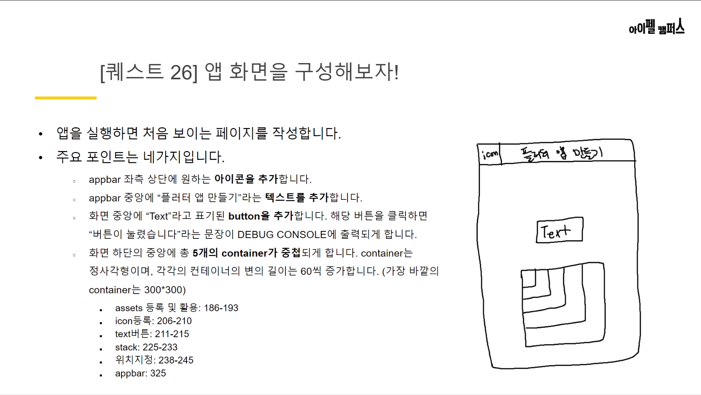
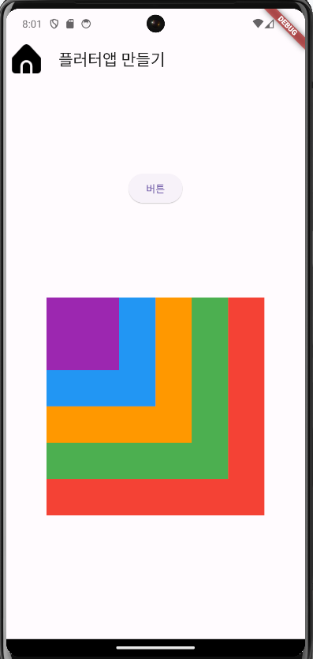

# flutter_subqeust02 Instruction


# 앱 트리 구조


# 앱 구현 화면


# AIFFEL Campus Online Code Peer Review Templete
- 코더 : 코더의 이름을 작성하세요.
- 리뷰어 : 리뷰어의 이름을 작성하세요.


# PRT(Peer Review Template)
- [X]  **1. 주어진 문제를 해결하는 완성된 코드가 제출되었나요?**
    거의 다 완성되었는데 텍스트 버튼이랑 stack이 각각 화면과 화면 하단 중앙이 아니시다.
    아이콘이 아니라 이미지를 넣으셨다.
    
- [X]  **2. 전체 코드에서 가장 핵심적이거나 가장 복잡하고 이해하기 어려운 부분에 작성된 
주석 또는 doc string을 보고 해당 코드가 잘 이해되었나요?**
    주석이 없으신 것 같다.
         
- [X]  **3. 에러가 난 부분을 디버깅하여 문제를 “해결한 기록을 남겼거나” 
”새로운 시도 또는 추가 실험을 수행”해봤나요?**
  그렇지는 않은 것 같습니다.
                
- [O]  **4. 회고를 잘 작성했나요?**
    회고가 잘 작성된 것 같습니다.
        
- [O]  **5. 코드가 간결하고 효율적인가요?**
    코드가 간결한 것 같습니다.
    구조를 트리로 그려주셔서 이해하기 편한 것 같습니다.

# 참고 링크 및 코드 개선
```
# 코드 리뷰 시 참고한 링크가 있다면 링크와 간략한 설명을 첨부합니다.
# 코드 리뷰를 통해 개선한 코드가 있다면 코드와 간략한 설명을 첨부합니다.
```
